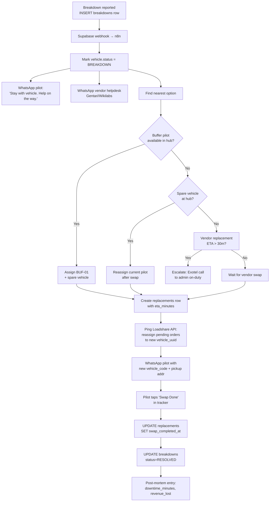

# Automation Logic — Vehicle Replacement (3W EV breakdown mid-shift)

**Goal:** minimise downtime when a 3W EV breaks down. Every minute idle costs
per-order revenue and an SLA breach on the Loadshare contract.

**Promise to admin:** from breakdown report → pilot on a replacement vehicle
in **≤ 45 min** in the same hub radius.

## Triggers

A `breakdowns` row gets created by **any** of the following:
1. Pilot taps "Report Breakdown" in the tracker PWA (new button, phase 2).
2. Admin creates the breakdown in Retool.
3. **Idle-2h watchdog**: n8n cron sees an ACTIVE pilot with zero `order_events` for 120 min during shift hours → auto-opens a breakdown row with `category = OTHER` for admin to classify.

## Workflow diagram



## Step-by-step (what happens, who does what)

| # | When | Actor | Action | System record |
|---|------|-------|--------|----------------|
| 1 | T+0 | Pilot / Admin / Cron | Breakdown reported with lat/lng + category | `INSERT INTO breakdowns(...)` |
| 2 | T+0s | Supabase | DB trigger posts webhook to n8n `/breakdown-handler` | `automation_runs` row |
| 3 | T+5s | n8n | `UPDATE vehicles SET status='BREAKDOWN'` | - |
| 4 | T+10s | n8n → Interakt | Template `pilot_breakdown_ack` to pilot's phone | `notifications(channel=WHATSAPP)` |
| 5 | T+10s | n8n → Interakt | Template `vendor_breakdown_alert` with vehicle_code, location map link, pilot contact | `notifications` |
| 6 | T+15s | n8n | Query: `active buffer pilots at hub` AND `vehicles where status=ACTIVE and vehicle_uuid not in active assignments` | - |
| 7a | T+30s | n8n (buffer found) | Create `replacements` row; WhatsApp buffer with handover details | `replacements` |
| 7b | T+30s | n8n (no buffer) | Escalate — Exotel `connect_call` to on-duty admin | `notifications(channel=CALL)` |
| 8 | T+10–30m | Vendor/Buffer | Reaches breakdown site | admin marks `arrived` in Retool |
| 9 | T+12–35m | Admin / n8n | Call Loadshare "reassign orders" API for pending orders on `from_vehicle_uuid` → `to_vehicle_uuid` | `orders.pilot_uuid` + `orders.vehicle_uuid` updated |
| 10 | T+15–40m | Pilot | Taps "Swap Done" in tracker | `UPDATE replacements SET swap_completed_at = now()` |
| 11 | T+15–40m | n8n | Close the loop: `UPDATE breakdowns SET status='RESOLVED', resolved_at=now()` | - |
| 12 | T+1d | Cron | Post-mortem: compute `downtime_minutes`, deliveries lost, revenue impact → append to `breakdowns.notes` | - |

## n8n workflow (pseudocode)

```yaml
name: vehicle-replacement
trigger:
  type: webhook
  path: /breakdown-handler
steps:
  - id: fetch_breakdown
    type: supabase.select
    table: breakdowns
    filter: breakdown_uuid = {{ $json.breakdown_uuid }}

  - id: mark_vehicle_down
    type: supabase.update
    table: vehicles
    where: vehicle_uuid = {{ fetch_breakdown.vehicle_uuid }}
    set: { status: 'BREAKDOWN' }

  - id: notify_pilot
    type: interakt.send_template
    template: pilot_breakdown_ack
    to: {{ pilot.phone }}

  - id: notify_vendor
    type: interakt.send_template
    template: vendor_breakdown_alert
    to: {{ vendor.helpdesk_whatsapp }}
    vars:
      vehicle_code: {{ vehicle.vehicle_code }}
      gmaps_link: "https://maps.google.com/?q={{ lat }},{{ lng }}"
      pilot_phone: {{ pilot.phone }}

  - id: find_buffer
    type: supabase.rpc
    fn: find_available_buffer
    args:
      hub_uuid: {{ pilot.home_hub_uuid }}
      at: now()

  - id: branch_buffer
    type: if
    condition: {{ find_buffer.rows.length > 0 }}
    then:
      - id: create_replacement
        type: supabase.insert
        table: replacements
        row:
          breakdown_uuid: {{ fetch_breakdown.breakdown_uuid }}
          from_vehicle_uuid: {{ fetch_breakdown.vehicle_uuid }}
          to_vehicle_uuid: {{ find_buffer.spare_vehicle_uuid }}
          buffer_pilot_uuid: {{ find_buffer.pilot_uuid }}
          eta_minutes: 20
          status: PENDING
      - id: wa_buffer
        type: interakt.send_template
        template: buffer_dispatch
    else:
      - id: escalate_admin
        type: exotel.connect_call
        from: {{ env.exotel_caller_id }}
        to: {{ env.on_duty_admin_phone }}

  - id: loadshare_reassign
    type: http.post
    url: {{ env.loadshare_reassign_url }}
    body:
      from_vehicle: {{ fetch_breakdown.vehicle_uuid }}
      to_vehicle: {{ create_replacement.to_vehicle_uuid }}

  - id: wait_for_swap
    type: wait_for_webhook
    path: /swap-complete/{{ create_replacement.replacement_uuid }}
    timeout: 90m

  - id: close_breakdown
    type: supabase.update
    table: breakdowns
    where: breakdown_uuid = {{ fetch_breakdown.breakdown_uuid }}
    set: { status: 'RESOLVED', resolved_at: now() }
```

## Edge cases to handle

| Case | Handling |
|------|----------|
| Pilot reports breakdown but no GPS | Use last known location from `attendance_events` |
| Vendor helpdesk doesn't acknowledge within 15 min | Auto-reminder WhatsApp + Exotel call to vendor SPOC |
| No buffer AND no spare vehicle | Admin must decide: trip-sheet partial completion + refund to Loadshare |
| Pilot refuses replacement | Open `ticket` type=`PILOT_COMPLAINT`, auto-assign to admin |
| Same vehicle breaks down twice in 7 days | Auto-flag for `maintenance` type=`INSPECTION`, block re-dispatch until cleared |
| Battery-cause breakdown during peak charging hours | Log to `battery_logs` with `cost_inr = null, reason = 'mid-shift'` for vendor SLA claim |

## KPIs for the workflow itself

- **MTTR (Mean Time To Replace):** target < 45 min, breach if > 60 min
- **First-response WA ack from vendor:** target < 5 min
- **Buffer utilisation:** >30% means too many buffers, <5% means under-provisioned
