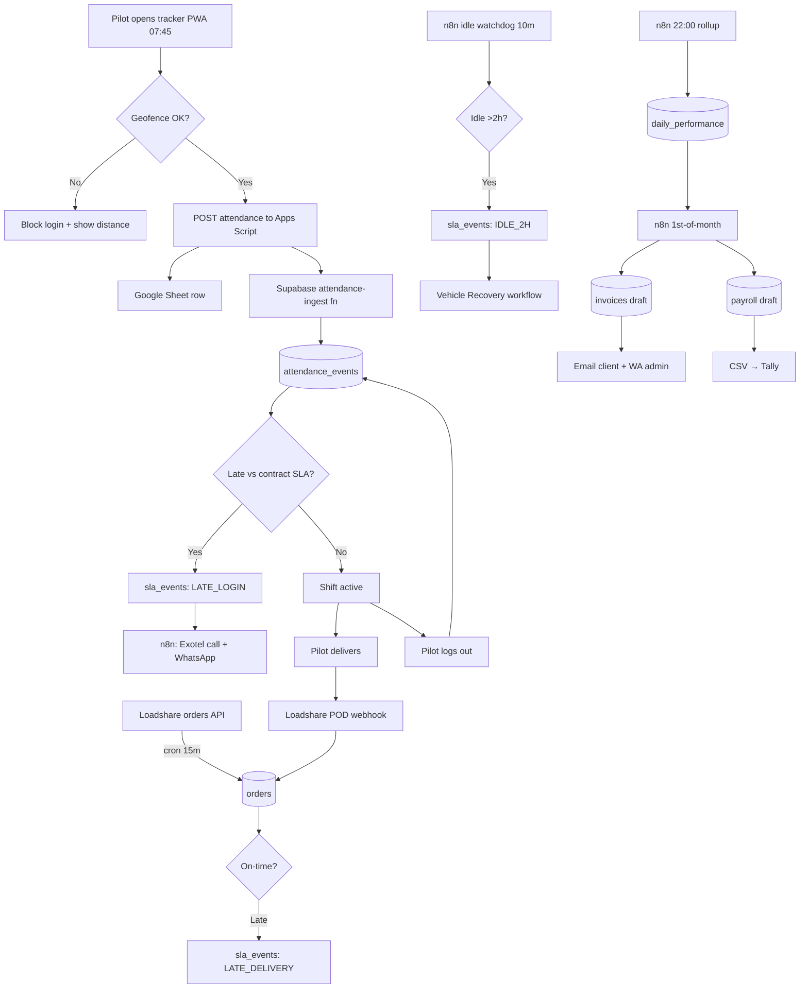

# System Map — Morning Attendance → End-of-Month Invoice

## Narrative flow

1. **07:45 — Pilot arrives at hub.** Opens the existing tracker PWA on their phone.
2. **Geofence check.** `checkAtHub()` in `src/DmartTracker.jsx:48` confirms they are within `radius` metres of the hub lat/lng.
3. **Login captured.** Apps Script posts `{empId, vehicleId, loginTime, lat, lng}` to the Google Sheet AND forwards to Supabase `attendance-ingest` edge function.
4. **DB trigger fires.** `attendance_events` insert → trigger `fn_evaluate_shift_start_sla()` compares `login_time` to `contracts.shift_start_time` for the pilot's assigned client.
5. **SLA breach?** If `login_time > shift_start + 10 min`, a row is inserted into `sla_events` (type: `LATE_LOGIN`) and n8n webhook is called.
6. **n8n reacts.** For `LATE_LOGIN`: triggers Exotel click-to-call on the pilot's number; sends WhatsApp ("Where are you? Reply 1=on the way, 2=issue").
7. **Orders arrive.** Loadshare API → n8n cron (every 15 min) → `orders` table. Each order carries `promised_delivery_at`.
8. **Pilot completes deliveries.** Loadshare sends webhooks on POD → updates `orders.delivered_at`, `orders.status`. On-time % computed live.
9. **Idle watchdog.** Every 10 min, n8n checks: any active pilot with no `order_events` in the last 120 min? → `sla_events` type `IDLE_2H` → WhatsApp backup driver + vendor (see `vehicle-replacement.md`).
10. **Logout.** Pilot logs out in tracker → `attendance_events` row closes → shift hours computed.
11. **End of day.** n8n 22:00 cron: `fn_daily_rollup()` aggregates into `daily_performance` (orders, on-time %, hours, km, SLA breaches).
12. **End of month.** n8n 1st-of-month cron: `fn_generate_invoice()` joins `daily_performance` + `contracts.rate_card` → `invoices` draft → PDF → email to client + WhatsApp to admin for approval.
13. **Payroll.** Same cron: `fn_generate_payroll()` joins `daily_performance` + `pilots.pay_rate` → `payroll` draft → CSV export for Tally/bank.

## Mermaid — end-to-end flow

## Data contracts at each hop

| Hop | Payload | Schema |
|-----|---------|--------|
| Tracker → Apps Script | `{empId, vehicleId, event: 'login'/'logout', ts, lat, lng, hub}` | JSON |
| Apps Script → Supabase | same + `source: 'tracker-v1'` | POST `/attendance-ingest` |
| Supabase → n8n (SLA breach) | `{sla_event_id, pilot_uuid, type, severity}` | webhook |
| Loadshare → n8n | `{order_id, pilot_id, promised_at, delivered_at, status}` | REST/webhook |
| n8n → Interakt | template + variables | Interakt API |
| n8n → Exotel | `{from, to, caller_id}` | Exotel connect-call API |
| Monthly rollup → invoice PDF | `{client_id, period, line_items[]}` | DB view + PDF gen |
